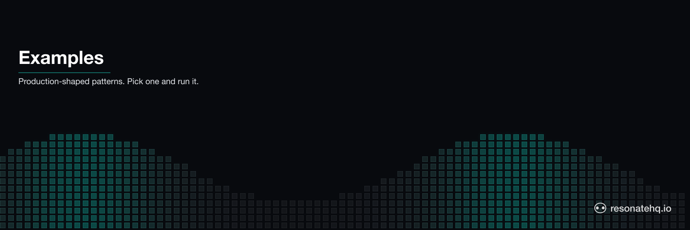
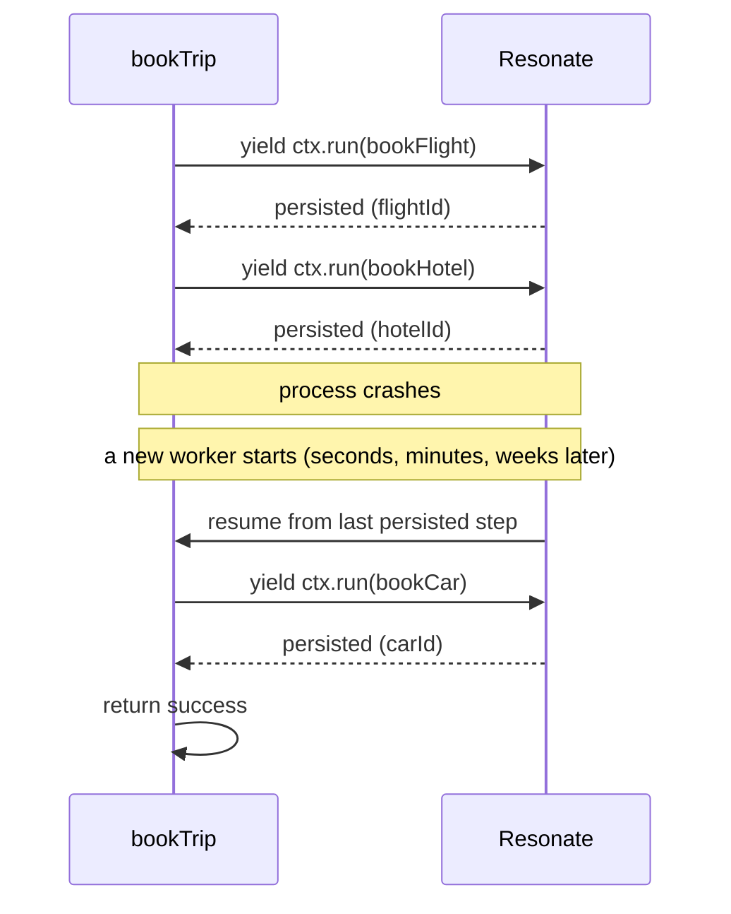

<picture>
  <source media="(prefers-color-scheme: dark)" srcset="./assets/readme-banner-dark.png">
  <source media="(prefers-color-scheme: light)" srcset="./assets/readme-banner-light.png">
  
</picture>

# Resonate Examples

**Your code dies when the process dies. Resonate makes that not happen.** You write normal functions with `yield`; Resonate persists each step so they survive crashes, restarts, and long waits — minutes, hours, or weeks.

That's *durable execution*: the function's progress is the source of truth. If the worker crashes mid-saga, the next worker resumes at the last completed step. No state-machine DSL, no orchestration glue. The same shape Temporal-class systems give you, written as ordinary code.

Resonate is built for the agent-native era — SDKs, tools, and operating surface are designed for AI agents to consume directly, not just for humans. The repos in this org demonstrate the patterns end-to-end. Pin the SDK, clone, run.

[Documentation](https://docs.resonatehq.io) · [Distributed async/await](https://distributed-async-await.io)

## What it looks like

Here's a saga in Resonate — book a flight, hotel, and car; if any step fails, compensate in reverse. Every `yield* ctx.run()` is a durable checkpoint.

```typescript
// from example-saga-booking-ts/src/workflow.ts
// https://github.com/resonatehq-examples/example-saga-booking-ts/blob/873a793/src/workflow.ts
import type { Context } from "@resonatehq/sdk";

export function* bookTrip(ctx: Context, tripId: string, shouldFail: boolean) {
  let flightId: string | undefined;
  let hotelId: string | undefined;

  try {
    flightId    = yield* ctx.run(bookFlight, tripId);
    hotelId     = yield* ctx.run(bookHotel,  tripId);
    const carId = yield* ctx.run(bookCarRental, tripId, shouldFail,
      ctx.options({ retryPolicy: noRetry }));
    return { status: "success", tripId, flightId, hotelId, carId };
  } catch (error) {
    // Compensate in reverse — each compensation is itself durable
    if (hotelId)  yield* ctx.run(cancelHotel,  tripId, hotelId);
    if (flightId) yield* ctx.run(cancelFlight, tripId, flightId);
    return { status: "failed", tripId, error: (error as Error).message };
  }
}
```

What happens when the worker crashes mid-booking:



No checkpoint table to maintain. No replay logic to write. The generator's position *is* the state.

## Start here

New to Resonate? Begin with one of these.

- [Quickstart (TypeScript)](https://github.com/resonatehq-examples/example-quickstart-ts) — a countdown that survives restarts
- [Quickstart (Python)](https://github.com/resonatehq-examples/example-quickstart-py) — same shape, Python idioms
- [Hello World (Rust)](https://github.com/resonatehq-examples/example-hello-world-rs) — the first Rust SDK example

## Featured examples

A curated set, organized by what each one demonstrates. Each shows the distinctive line of Resonate that makes the pattern unusual.

### Patterns

- [Saga + compensation](https://github.com/resonatehq-examples/example-saga-booking-ts) — flight + hotel + car; failure triggers the compensation chain
  `try { yield* ctx.run(bookFlight) } catch { yield* ctx.run(cancelFlight) }`
- [Fan-out / fan-in](https://github.com/resonatehq-examples/example-fan-out-fan-in-ts) — parallel notification channels with per-channel retry
  `const results = yield* ctx.all(channels.map(c => ctx.run(notify, c)))`
- [Distributed mutex](https://github.com/resonatehq-examples/example-distributed-mutex-ts) — a serialized lock in ~15 lines, no signal API
  `yield* ctx.lock(resource); /* critical section */`

### Integrations

- [Next.js (App Router)](https://github.com/resonatehq-examples/example-nextjs-integration-ts) — Server Actions trigger durable workflows; status polling
  `await resonate.invoke("checkout", { id })  // from a Server Action`
- [AWS Lambda](https://github.com/resonatehq-examples/example-aws-lambda-ts) — Lambda as a stateless trigger; breaks the timeout ceiling
  `export const handler = (event) => resonate.invoke("processDoc", event)`
- [Cloudflare Workers](https://github.com/resonatehq-examples/example-countdown-cloudflare-ts) — durable sleep across edge invocations
  `yield* ctx.sleep("7d")  // survives worker recycling`

### Agents

- [Templated agent](https://github.com/resonatehq-examples/templated-agent-ts) — extensible agent template, Crawl / Walk / Run progression
- [Multi-agent orchestration](https://github.com/resonatehq-examples/example-multi-agent-orchestration-ts) — researcher → writer → reviewer with durable handoffs
  `const draft = yield* ctx.run(writer, yield* ctx.run(researcher, topic))`
- [Deep research agent](https://github.com/resonatehq-examples/example-openai-deep-research-agent-ts) — recursive AI research powered by OpenAI

### Human-in-the-loop

- [Approval workflow](https://github.com/resonatehq-examples/example-human-in-the-loop-ts) — a function that suspends pending human input
  `const decision = yield* ctx.promise<"approve" | "reject">(approvalId)`
- [Kubernetes node drain](https://github.com/resonatehq-examples/example-node-drain-orchestrator-ts) — durable orchestration with operator confirmation

## Browse all examples

Beyond Featured, the rest of the catalog grouped by what each example demonstrates.

**Patterns** — [batch-processor](https://github.com/resonatehq-examples/example-batch-processor-ts) · [durable-chatbot](https://github.com/resonatehq-examples/example-durable-chatbot-ts) · [durable-entity](https://github.com/resonatehq-examples/example-durable-entity-ts) · [event-sourcing](https://github.com/resonatehq-examples/example-event-sourcing-ts) · [encryption](https://github.com/resonatehq-examples/example-encryption-ts) · [food-delivery](https://github.com/resonatehq-examples/example-food-delivery-ts) · [infinite-workflow](https://github.com/resonatehq-examples/example-infinite-workflow-ts) · [priority-queue](https://github.com/resonatehq-examples/example-priority-queue-ts) · [rate-limiter](https://github.com/resonatehq-examples/example-rate-limiter-ts) · [recursive-factorial (TS)](https://github.com/resonatehq-examples/example-recursive-factorial-ts) · [recursive-factorial (Py)](https://github.com/resonatehq-examples/example-recursive-factorial-py) · [state-machine](https://github.com/resonatehq-examples/example-state-machine-ts) · [webhook-handler](https://github.com/resonatehq-examples/example-webhook-handler-ts)

**Integrations** — [browser-worker](https://github.com/resonatehq-examples/example-browser-worker-ts) · [countdown-gcp](https://github.com/resonatehq-examples/example-countdown-gcp-ts) · [countdown-supabase](https://github.com/resonatehq-examples/example-countdown-supabase-ts) · [countdown-web](https://github.com/resonatehq-examples/example-countdown-web-ts) · [databricks-in-the-loop](https://github.com/resonatehq-examples/example-databricks-in-the-loop-py) · [express-integration](https://github.com/resonatehq-examples/example-express-integration-ts) · [function-as-a-service](https://github.com/resonatehq-examples/example-function-as-a-service-py) · [kafka-worker (Py)](https://github.com/resonatehq-examples/example-kafka-worker-py) · [load-balancing (TS)](https://github.com/resonatehq-examples/example-load-balancing-ts) · [load-balancing (Py)](https://github.com/resonatehq-examples/example-load-balancing-py) · [mcp-tools](https://github.com/resonatehq-examples/example-mcp-tools-ts) · [nextjs-ecommerce](https://github.com/resonatehq-examples/example-nextjs-ecommerce-ts) · [supabase-edge](https://github.com/resonatehq-examples/example-supabase-edge-ts) · [tigerbeetle-account-creation](https://github.com/resonatehq-examples/example-tigerbeetle-account-creation-ts) · [webservers (Py)](https://github.com/resonatehq-examples/example-webservers-py)

**Agents & AI** — [ai-image-pipeline](https://github.com/resonatehq-examples/example-ai-image-pipeline-ts) · [ai-travel-assistant (Py)](https://github.com/resonatehq-examples/example-ai-travel-assistant-py) · [async-tools-mcp-server (Py)](https://github.com/resonatehq-examples/example-async-tools-mcp-server-py) · [bluesky-scraper](https://github.com/resonatehq-examples/example-bluesky-scraper-ts) · [hackernews-research-agent (Py)](https://github.com/resonatehq-examples/example-hackernews-research-agent-py) · [agent-tool-background-job](https://github.com/resonatehq-examples/example-agent-tool-background-job) · [openai-deep-research-agent (Cloudflare)](https://github.com/resonatehq-examples/example-openai-deep-research-agent-cloudflare-ts) · [openai-deep-research-agent (GCP)](https://github.com/resonatehq-examples/example-openai-deep-research-agent-gcp-ts) · [openai-deep-research-agent (Supabase)](https://github.com/resonatehq-examples/example-openai-deep-research-agent-supabase-ts) · [openai-deep-research-agent (Py)](https://github.com/resonatehq-examples/example-openai-deep-research-agent-py) · [schedule-reminder-agent (Py)](https://github.com/resonatehq-examples/example-schedule-reminder-agent-py)

**RPC, HTTP & infra** — [async-http-api (TS)](https://github.com/resonatehq-examples/example-async-http-api-ts) · [async-http-api (Py)](https://github.com/resonatehq-examples/example-async-http-api-py) · [async-rpc (Py)](https://github.com/resonatehq-examples/example-async-rpc-py) · [dao-proposal-scorer](https://github.com/resonatehq-examples/example-dao-proposal-scorer-ts) · [distributed-calculator (Py)](https://github.com/resonatehq-examples/example-distributed-calculator-py) · [durable-sleep (TS)](https://github.com/resonatehq-examples/example-durable-sleep-ts) · [durable-sleep (Py)](https://github.com/resonatehq-examples/example-durable-sleep-py) · [hello-world (TS)](https://github.com/resonatehq-examples/example-hello-world-ts) · [hello-world (Py)](https://github.com/resonatehq-examples/example-hello-world-py) · [hello-world (Rust)](https://github.com/resonatehq-examples/example-hello-world-rs) · [fan-out-fan-in (Rust)](https://github.com/resonatehq-examples/example-fan-out-fan-in-rs) · [schedule (TS)](https://github.com/resonatehq-examples/example-schedule-ts) · [schedule (Py)](https://github.com/resonatehq-examples/example-schedule-py) · [token-auth](https://github.com/resonatehq-examples/example-token-auth-ts) · [resonate-connect-temporal](https://github.com/resonatehq-examples/resonate-connect-temporal)

Or browse on GitHub: [TypeScript](https://github.com/orgs/resonatehq-examples/repositories?q=ts&type=all) · [Python](https://github.com/orgs/resonatehq-examples/repositories?q=py&type=all) · [Rust](https://github.com/orgs/resonatehq-examples/repositories?q=rs&type=all)

## Momentum

- **75 example repos** across TypeScript, Python, and Rust
- **3 SDKs** — all on the same protocol ([TypeScript](https://github.com/resonatehq/resonate-sdk-ts) · [Python](https://github.com/resonatehq/resonate-sdk-py) · [Rust](https://github.com/resonatehq/resonate-sdk-rs))
- **23 Journal posts** at [journal.resonatehq.io](https://journal.resonatehq.io) — patterns, walkthroughs, and the design rationale behind the protocol
- **3 published specifications** — [Distributed Async Await](https://distributed-async-await.io) (served), [Async RPC](https://github.com/resonatehq/async-rpc.io), [Durable Promise](https://github.com/resonatehq/durable-promise-specification)

## Community

- Discord: https://resonatehq.io/discord
- X: https://x.com/resonatehqio
- LinkedIn: https://linkedin.com/company/resonatehq
- YouTube: https://youtube.com/@resonatehq
- Journal: https://journal.resonatehq.io

## License

All examples in this organization are licensed under [Apache-2.0](./LICENSE). Each example repo carries its own `LICENSE` file.

## Contributing

Want to add an example? See [CONTRIBUTING.md](https://github.com/resonatehq-examples/.github/blob/main/CONTRIBUTING.md) for the quality bar and submission flow. To propose a new example or report a broken one, open an issue using the templates at [`.github` issues](https://github.com/resonatehq-examples/.github/issues/new/choose). Security issues: see [SECURITY.md](https://github.com/resonatehq-examples/.github/blob/main/SECURITY.md).
