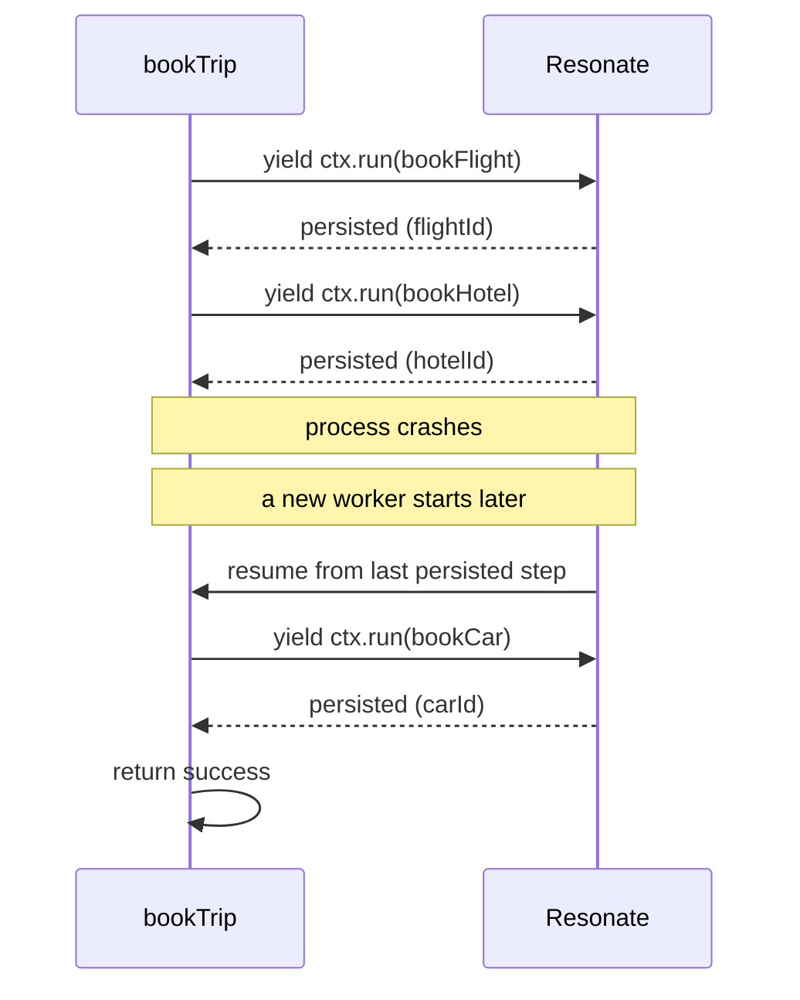

<picture>
  <source media="(prefers-color-scheme: dark)" srcset="./assets/readme-banner-dark.png">
  <source media="(prefers-color-scheme: light)" srcset="./assets/readme-banner-light.png">
  
</picture>

# Resonate Examples

**Your code dies when the process dies. Resonate makes that not happen.** You write normal functions; Resonate persists each step so they survive crashes, restarts, and long waits — minutes, hours, or weeks.

That's *durable execution*: the function's progress is the source of truth. If the worker crashes mid-saga, the next worker resumes at the last completed step. No state-machine DSL, no orchestration glue. And because it's just ordinary code, it works the same way whether a human wrote it or an agent did — Resonate's SDKs, CLI, and protocol are shaped for both.

The repos in this org demonstrate the patterns end-to-end. Pin the SDK, clone, run.

```bash
brew install resonatehq/tap/resonate    # the server
npm  install @resonatehq/sdk            # or: pip install resonate-sdk · cargo add resonate-sdk
```

[Documentation](https://docs.resonatehq.io) · [Distributed async/await](https://distributed-async-await.io)

## What it looks like

Here's a saga in Resonate — book a flight, hotel, and car; if any step fails, compensate in reverse. Every `yield* ctx.run()` is a durable checkpoint.

```typescript
// from example-saga-booking-ts/src/workflow.ts
// https://github.com/resonatehq-examples/example-saga-booking-ts/blob/873a793/src/workflow.ts
import type { Context } from "@resonatehq/sdk";
// ... service imports + a `noRetry` retry policy + a `BookingResult` type

export function* bookTrip(
  ctx: Context,
  tripId: string,
  shouldFail: boolean,
): Generator<any, BookingResult, any> {
  let flightId: string | undefined;
  let hotelId: string | undefined;

  try {
    flightId = yield* ctx.run(bookFlight, tripId);
    hotelId = yield* ctx.run(bookHotel, tripId);
    const carId = yield* ctx.run(
      bookCarRental,
      tripId,
      shouldFail,
      ctx.options({ retryPolicy: noRetry }),
    );
    return { status: "success", tripId, flightId, hotelId, carId };
  } catch (error) {
    const message = (error as Error).message;
    const compensated: string[] = [];

    // Compensate in reverse order — each compensation is also durable
    if (hotelId) {
      yield* ctx.run(cancelHotel, tripId, hotelId);
      compensated.push("hotel");
    }

    if (flightId) {
      yield* ctx.run(cancelFlight, tripId, flightId);
      compensated.push("flight");
    }

    return { status: "failed", tripId, error: message, compensated };
  }
}
```

What happens when the worker crashes mid-booking:



No checkpoint table to maintain. No replay logic to write. The generator's position *is* the state.

## Start here

New to Resonate? Begin with one of these.

- [Quickstart (TypeScript)](https://github.com/resonatehq-examples/example-quickstart-ts) — a countdown that survives restarts
- [Quickstart (Python)](https://github.com/resonatehq-examples/example-quickstart-py) — same shape, Python idioms
- [Hello World (Rust)](https://github.com/resonatehq-examples/example-hello-world-rs) — the first Rust SDK example

## Featured examples

A curated set, organized by what each one demonstrates.

### Patterns

- [Saga + compensation](https://github.com/resonatehq-examples/example-saga-booking-ts) — flight + hotel + car; failure triggers the compensation chain
- [Fan-out / fan-in](https://github.com/resonatehq-examples/example-fan-out-fan-in-ts) — parallel notification channels with per-channel retry
- [Distributed mutex](https://github.com/resonatehq-examples/example-distributed-mutex-ts) — a serialized lock in ~15 lines; the generator IS the lock

### Integrations

- [Next.js (App Router)](https://github.com/resonatehq-examples/example-nextjs-integration-ts) — Server Actions trigger durable workflows; status polling
- [AWS Lambda](https://github.com/resonatehq-examples/example-aws-lambda-ts) — Lambda as a stateless trigger; breaks the timeout ceiling
- [Cloudflare Workers](https://github.com/resonatehq-examples/example-countdown-cloudflare-ts) — durable sleep across edge invocations

### Agents

- [Templated agent](https://github.com/resonatehq-examples/templated-agent-ts) — extensible agent template, Crawl / Walk / Run progression
- [Multi-agent orchestration](https://github.com/resonatehq-examples/example-multi-agent-orchestration-ts) — researcher → writer → reviewer with durable handoffs
- [Deep research agent](https://github.com/resonatehq-examples/example-openai-deep-research-agent-ts) — recursive AI research powered by OpenAI

### Human-in-the-loop

- [Approval workflow](https://github.com/resonatehq-examples/example-human-in-the-loop-ts) — a function that suspends until a human resolves a promise
- [Kubernetes node drain](https://github.com/resonatehq-examples/example-node-drain-orchestrator-ts) — durable orchestration with operator confirmation

## Browse all examples

Beyond Featured — the rest of the catalog grouped by what each example demonstrates. Click to expand.

<details>
<summary><strong>Patterns</strong> (13 more)</summary>

- [batch-processor](https://github.com/resonatehq-examples/example-batch-processor-ts) — durable progress checkpointing across batches
- [durable-chatbot](https://github.com/resonatehq-examples/example-durable-chatbot-ts) — multi-turn LLM chat with crash-recoverable conversation state
- [durable-entity](https://github.com/resonatehq-examples/example-durable-entity-ts) — long-lived entity with durable idle timeout
- [event-sourcing](https://github.com/resonatehq-examples/example-event-sourcing-ts) — projection from durable event stream, no event store needed
- [encryption](https://github.com/resonatehq-examples/example-encryption-ts) — AES-256-GCM payload encryption via Encryptor interface
- [food-delivery](https://github.com/resonatehq-examples/example-food-delivery-ts) — order → kitchen → driver → pickup → delivery as a durable workflow
- [infinite-workflow](https://github.com/resonatehq-examples/example-infinite-workflow-ts) — while-loop + ctx.sleep; no continueAsNew needed
- [priority-queue](https://github.com/resonatehq-examples/example-priority-queue-ts) — 4-tier priority with per-tier concurrency limits
- [rate-limiter](https://github.com/resonatehq-examples/example-rate-limiter-ts) — sleep-based spacing for N requests per second
- [recursive-factorial (TS)](https://github.com/resonatehq-examples/example-recursive-factorial-ts) · [(Py)](https://github.com/resonatehq-examples/example-recursive-factorial-py) — distributed recursive computation
- [state-machine](https://github.com/resonatehq-examples/example-state-machine-ts) — order lifecycle with the generator as the state
- [webhook-handler](https://github.com/resonatehq-examples/example-webhook-handler-ts) — exactly-once webhook processing with deduplication

</details>

<details>
<summary><strong>Integrations</strong> (15 more)</summary>

- [browser-worker](https://github.com/resonatehq-examples/example-browser-worker-ts) — a Resonate worker running in a browser tab
- [countdown-gcp](https://github.com/resonatehq-examples/example-countdown-gcp-ts) · [-supabase](https://github.com/resonatehq-examples/example-countdown-supabase-ts) · [-web](https://github.com/resonatehq-examples/example-countdown-web-ts) — durable sleep across surfaces
- [databricks-in-the-loop](https://github.com/resonatehq-examples/example-databricks-in-the-loop-py) — integrating Databricks notebooks with a backend service
- [express-integration](https://github.com/resonatehq-examples/example-express-integration-ts) — POST triggers durable workflow, GET polls status
- [function-as-a-service (Py)](https://github.com/resonatehq-examples/example-function-as-a-service-py) — on-prem FaaS demo with GPU worker routing
- [kafka-worker (Py)](https://github.com/resonatehq-examples/example-kafka-worker-py) — concurrent message processing without head-of-line blocking
- [load-balancing (TS)](https://github.com/resonatehq-examples/example-load-balancing-ts) · [(Py)](https://github.com/resonatehq-examples/example-load-balancing-py) — distribute work across worker pools
- [mcp-tools](https://github.com/resonatehq-examples/example-mcp-tools-ts) — Resonate behind an MCP server
- [nextjs-ecommerce](https://github.com/resonatehq-examples/example-nextjs-ecommerce-ts) — one-click buy with 5-second cancellation window, every step durable
- [supabase-edge](https://github.com/resonatehq-examples/example-supabase-edge-ts) — onboarding workflow triggered by Supabase Edge Function
- [tigerbeetle-account-creation](https://github.com/resonatehq-examples/example-tigerbeetle-account-creation-ts) — durable financial transactions with TigerBeetle
- [webservers (Py)](https://github.com/resonatehq-examples/example-webservers-py) — popular Python webserver framework integrations

</details>

<details>
<summary><strong>Agents &amp; AI</strong> (11 more)</summary>

- [ai-image-pipeline](https://github.com/resonatehq-examples/example-ai-image-pipeline-ts) — parallel AI image generation with crash recovery
- [ai-travel-assistant (Py)](https://github.com/resonatehq-examples/example-ai-travel-assistant-py) — multi-step AI agent with tool use
- [async-tools-mcp-server (Py)](https://github.com/resonatehq-examples/example-async-tools-mcp-server-py) — background weather collection for Claude Desktop
- [bluesky-scraper](https://github.com/resonatehq-examples/example-bluesky-scraper-ts) — durable social media ingestion
- [hackernews-research-agent (Py)](https://github.com/resonatehq-examples/example-hackernews-research-agent-py) — durable HN research agent
- [agent-tool-background-job](https://github.com/resonatehq-examples/example-agent-tool-background-job) — async timer tool via MCP
- [openai-deep-research-agent — Cloudflare](https://github.com/resonatehq-examples/example-openai-deep-research-agent-cloudflare-ts) · [GCP](https://github.com/resonatehq-examples/example-openai-deep-research-agent-gcp-ts) · [Supabase](https://github.com/resonatehq-examples/example-openai-deep-research-agent-supabase-ts) · [Python](https://github.com/resonatehq-examples/example-openai-deep-research-agent-py) — recursive AI research across deployment shapes
- [schedule-reminder-agent (Py)](https://github.com/resonatehq-examples/example-schedule-reminder-agent-py) — autonomous long-running reminder assistant

</details>

<details>
<summary><strong>RPC, HTTP &amp; foundations</strong> (15 more)</summary>

- [async-http-api (TS)](https://github.com/resonatehq-examples/example-async-http-api-ts) · [(Py)](https://github.com/resonatehq-examples/example-async-http-api-py) — submit job, poll for results
- [async-rpc (Py)](https://github.com/resonatehq-examples/example-async-rpc-py) — Remote Function Invocation across processes
- [dao-proposal-scorer](https://github.com/resonatehq-examples/example-dao-proposal-scorer-ts) — off-chain DAO scoring with cryptographic verification
- [distributed-calculator (Py)](https://github.com/resonatehq-examples/example-distributed-calculator-py) — arithmetic sub-expression distribution
- [durable-sleep (TS)](https://github.com/resonatehq-examples/example-durable-sleep-ts) · [(Py)](https://github.com/resonatehq-examples/example-durable-sleep-py) — sleep for hours, days, or years
- [hello-world (TS)](https://github.com/resonatehq-examples/example-hello-world-ts) · [(Py)](https://github.com/resonatehq-examples/example-hello-world-py) · [(Rust)](https://github.com/resonatehq-examples/example-hello-world-rs) — first durable function across SDKs
- [fan-out-fan-in (Rust)](https://github.com/resonatehq-examples/example-fan-out-fan-in-rs) — Rust fan-out/fan-in
- [schedule (TS)](https://github.com/resonatehq-examples/example-schedule-ts) · [(Py)](https://github.com/resonatehq-examples/example-schedule-py) — periodic function scheduling
- [token-auth](https://github.com/resonatehq-examples/example-token-auth-ts) — authentication patterns
- [resonate-connect-temporal](https://github.com/resonatehq-examples/resonate-connect-temporal) — connector

</details>

Or browse on GitHub directly: [TypeScript](https://github.com/orgs/resonatehq-examples/repositories?q=ts&type=all) · [Python](https://github.com/orgs/resonatehq-examples/repositories?q=py&type=all) · [Rust](https://github.com/orgs/resonatehq-examples/repositories?q=rs&type=all)

## Momentum

- **75 example repos** across TypeScript, Python, and Rust
- **23 Journal posts** at [journal.resonatehq.io](https://journal.resonatehq.io) — patterns, walkthroughs, design rationale
- **3 published specifications** — [Distributed Async Await](https://distributed-async-await.io) (served), [Async RPC](https://github.com/resonatehq/async-rpc.io), [Durable Promise](https://github.com/resonatehq/durable-promise-specification)

## Community

- Discord: https://resonatehq.io/discord
- X: https://x.com/resonatehqio
- LinkedIn: https://linkedin.com/company/resonatehq
- YouTube: https://youtube.com/@resonatehq
- Journal: https://journal.resonatehq.io

## License

All examples in this organization are licensed under [Apache-2.0](./LICENSE). Each example repo carries its own `LICENSE` file.

## Contributing

Want to add an example? See [CONTRIBUTING.md](https://github.com/resonatehq-examples/.github/blob/main/CONTRIBUTING.md) for the quality bar and submission flow. To propose a new example or report a broken one, open an issue using the templates at [`.github` issues](https://github.com/resonatehq-examples/.github/issues/new/choose). Security issues: see [SECURITY.md](https://github.com/resonatehq-examples/.github/blob/main/SECURITY.md).
